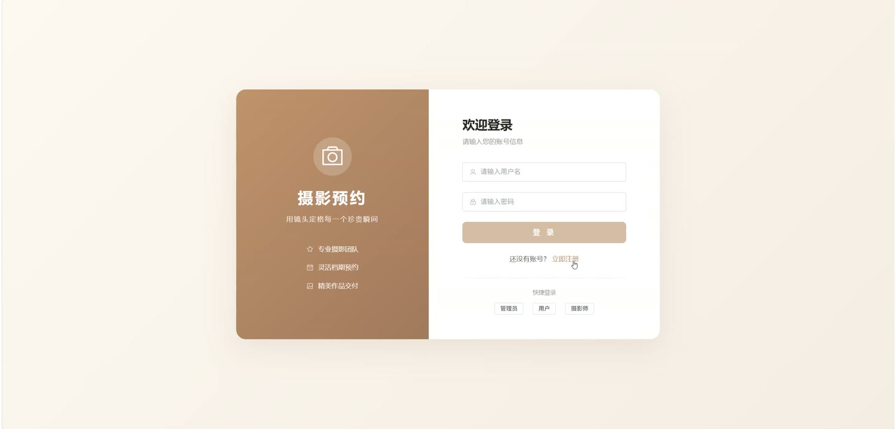
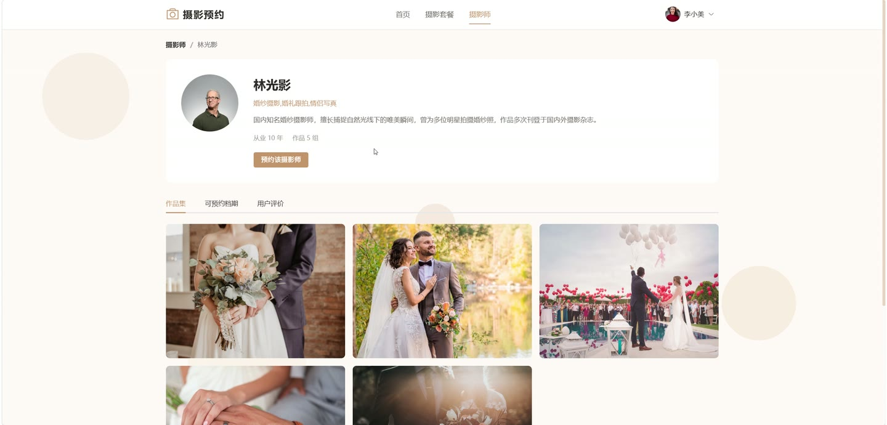
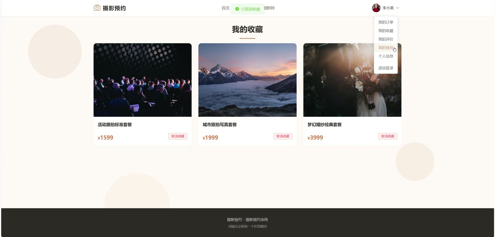
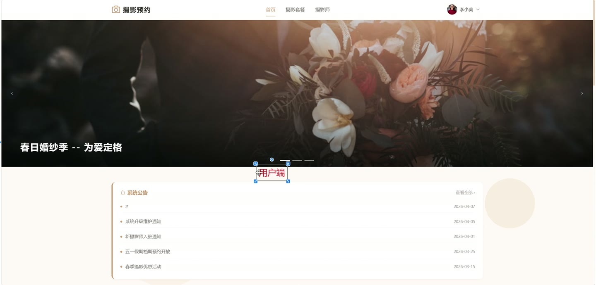
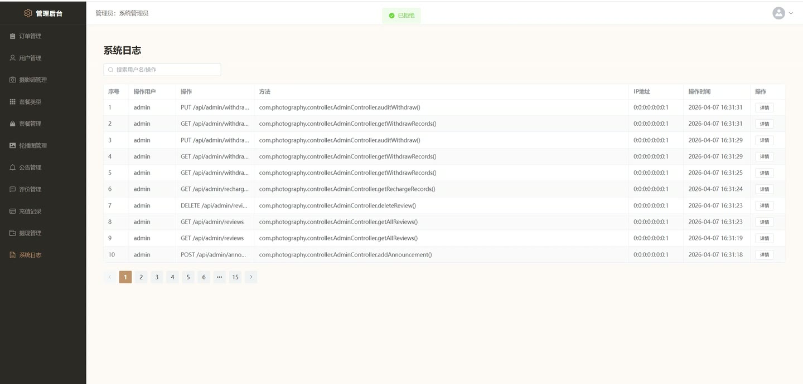

# (附文档)Springboot3+Vue3+MySQL 摄影预约系统

**技术栈**：Springboot3、Vue3、MySQL

### 系统简介

摄影预约系统是一个基于 Spring Boot 3 + Vue 3 的前后端分离项目，采用 JWT 进行身份认证。系统包含普通用户端、摄影师端和管理员端三个角色，实现了摄影套餐浏览、在线预约下单、摄影师档期管理、作品展示、钱包充值、评价互动及后台运营管理等完整业务流程。
 
### 核心功能
 
### 普通用户端

 
- 用户注册与登录（支持用户名密码注册，默认角色为普通用户） 
- 查看首页轮播图、热门套餐（前6条上架套餐）和启用公告 
- 按套餐类型筛选或关键词搜索摄影套餐列表 
- 查看套餐详情（包含价格、描述、图片集、拍摄时长、场景、包含内容） 
- 浏览摄影师列表（按昵称/风格关键词搜索，仅显示启用状态的摄影师） 
- 查看摄影师详情（个人简介、拍摄风格、从业年限、作品集、可预约档期、评价列表） 
- 收藏/取消收藏套餐，查看收藏列表（显示套餐名称、封面、价格） 
- 选择套餐、摄影师和档期后下单（下单时自动扣减余额） 
- 查看个人订单列表（按状态筛选：待接单/待拍摄/已完成/已评价/已拒绝/已取消） 
- 取消待接单状态的订单（自动退款并释放档期） 
- 账户充值（输入金额后余额增加并记录充值记录） 
- 查看余额、充值记录、消费记录、退款记录 
- 对已完成订单发表评价（评分1-5星、评价内容、上传图片） 
- 修改或删除已发表的评价（删除评价后订单状态恢复为已完成） 
- 查看个人评价列表 
- 修改个人资料（昵称、手机号、邮箱、头像等） 
- 修改登录密码（需验证旧密码）
 
### 摄影师端

 
- 上传作品（标题、描述、图片），编辑或删除自己的作品 
- 管理档期：添加档期（选择日期和时间段：上午/下午/全天），删除可预约状态的档期 
- 查看分配给自己的订单列表（按状态筛选） 
- 接单（将待接单订单状态改为待拍摄） 
- 拒绝订单（填写拒绝原因，系统自动退款给用户并释放档期） 
- 完成订单（将待拍摄订单标记为已完成） 
- 查看客户对自己的评价列表（显示用户昵称、头像、套餐名称） 
- 回复评价（填写回复内容，记录回复时间） 
- 查看个人收入（账户余额） 
- 发起提现申请（输入金额，系统扣除余额并生成待审核提现记录） 
- 查看提现记录列表（状态：待审核/已通过/已拒绝）
 
### 管理员端

 
- 管理普通用户：查看用户列表（支持用户名/昵称/手机号搜索），新增用户（默认密码123456），禁用/启用用户，删除用户 
- 管理摄影师：查看摄影师列表（支持搜索），新增摄影师（默认密码123456），禁用/启用摄影师，删除摄影师 
- 管理套餐类型：新增、编辑、删除套餐类型（有关联套餐时禁止删除），支持排序 
- 管理摄影套餐：新增、编辑套餐（名称、类型、价格、描述、封面、图片集、时长、场景、包含内容），上架/下架套餐 
- 管理轮播图：新增、编辑、删除轮播图（标题、图片、链接、排序、启用状态） 
- 管理公告：新增、编辑、删除公告（标题、内容、启用/禁用状态） 
- 查看所有订单列表（按订单状态筛选，按订单编号搜索，显示用户昵称、摄影师昵称、套餐名称） 
- 查看所有评价列表（显示用户昵称、头像、摄影师昵称、套餐名称），可删除评价（删除后订单状态恢复为已完成） 
- 查看充值记录列表 
- 查看提现记录列表，审核通过或拒绝提现申请 
- 查看系统操作日志（操作人、操作内容、请求方法、参数、IP地址、时间）
 
### 技术栈

  后端框架 Spring Boot 3   ORM MyBatis-Plus   权限认证 JWT（jjwt）   密码加密 BCryptPasswordEncoder   前端框架 Vue 3   状态管理 Pinia   路由 Vue Router   构建工具 Vite   数据库 MySQL 
 
### 交付内容

 
- 后端完整源码 
- 前端完整源码 
- 数据库初始化脚本 
- 万字文档

## 界面展示

---

## 获取完整源码 + 万字文档

本仓库为项目介绍页。**完整前后端源码、数据库初始化脚本、万字项目文档**，请加微信 `kangkangcode`，或访问 [codekk.top](http://codekk.top) 获取。

可作课程设计 / 毕业设计参考，支持远程部署调试。